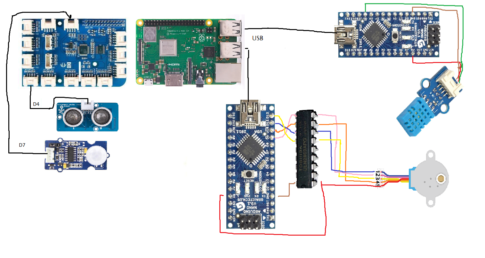
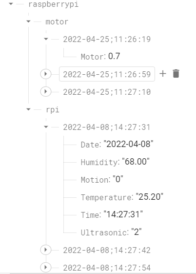
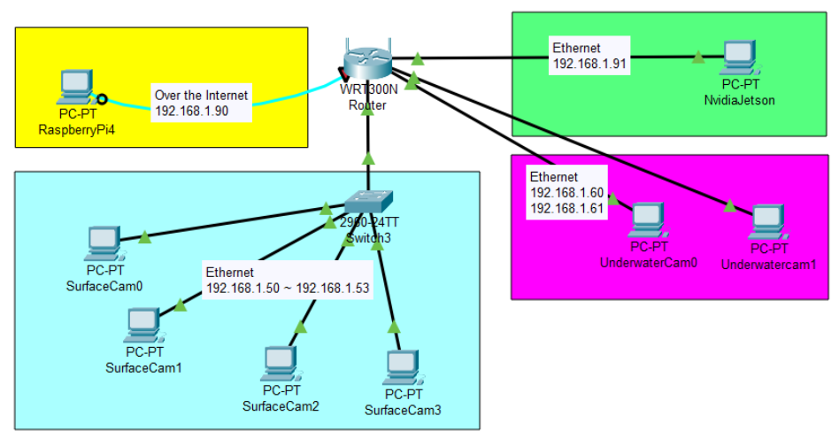

# Self Adaptive Aquatic Live Stock Feed Dispenser

This project's aim is to design and develop a adaptive self scheduling aquatic live stock feeding device that would adjust feeding schedules according to the produce's appetite and nutritional requirement through image analysis and ambient data analysis. This project is motivated by the 30 by 30 goal set by Singapore Food Agency to build resilience to external supplies.

This project compromises of 3 major parts, data collection, feed control and schedule optimization.
Data collection involves collecting and annotating data for training.
Feed control involves image segmentation of floating feeds
Schedule optimization involves studying behavior of fishes w.r.t feeding timetable using ant colony algorithm.

## Instructions

The folder `master` contains codes that are to be used in a RaspberryPi4 that is connected to a GrovePi board.

The folder `slave` contains codes that are to be used in an Arduino Nano RP2040.

The RaspberryPi4 depends on serial connection to the Arduino Nano RP2040 via USB.
For the stepper motor, ensure that it is connected to a motor driver such as a ULN2803.
The Nvidia Jetson communicates to the RaspberryPi4 and back using an external database of Firebase, such that the data transmitted can be stored and retrieved easily.

The `main.py` file is the main host for the RaspberryPi4 while an alternative for CSV files can be used in `main-csv.py`.
The `jetson.py` file is the main host for the Nvidia Jetson and will hold the Tensorflow Object Detection.

## IOT Setup

The RaspberryPi4 connected to a GrovePi board, wired to 2 Arduinos.

## Firebase JSON Database

Example of how the JSON file is stored.

## Network

Network of the entire setup, along with their static IPv4 ranges.

## Sources

Ubuntu Tensorflow = [tensorflow-aarch64](https://github.com/KumaTea/tensorflow-aarch64/releases)
Device Manager/RSTP IP Finder = [ONVIF Device Manager](https://learncctv.com/onvif-device-manager/)
Real-Time Database = [Firebase](https://www.youtube.com/watch?v=qKxisFLQRpQ)
